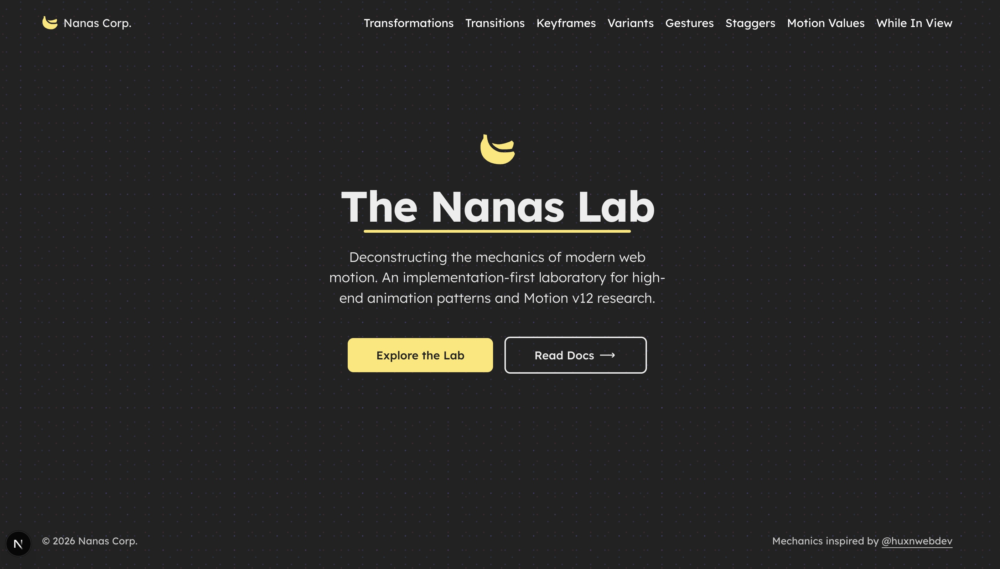
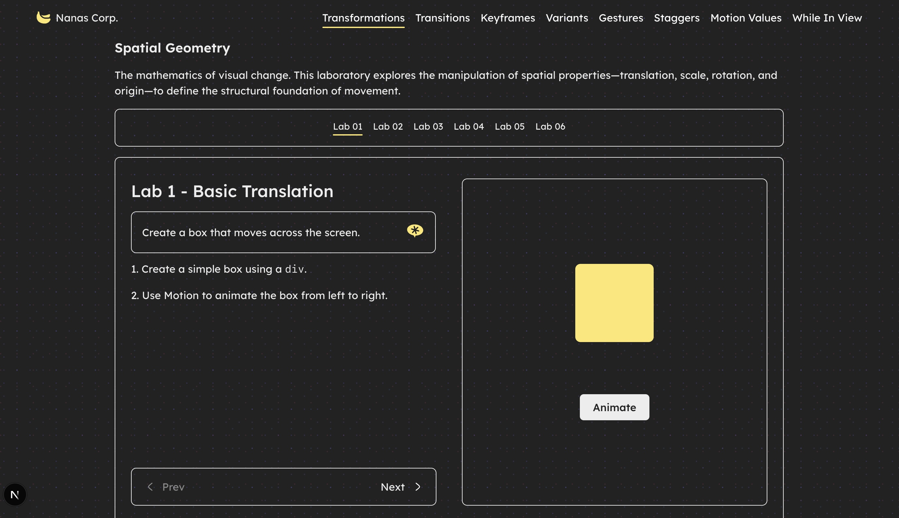
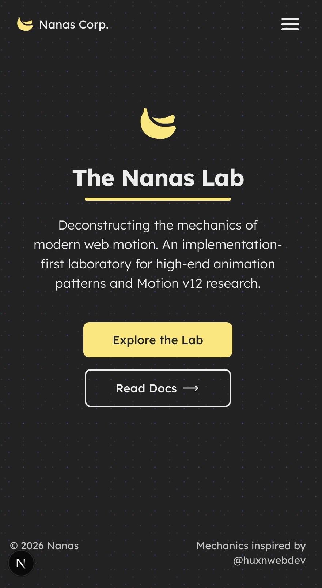
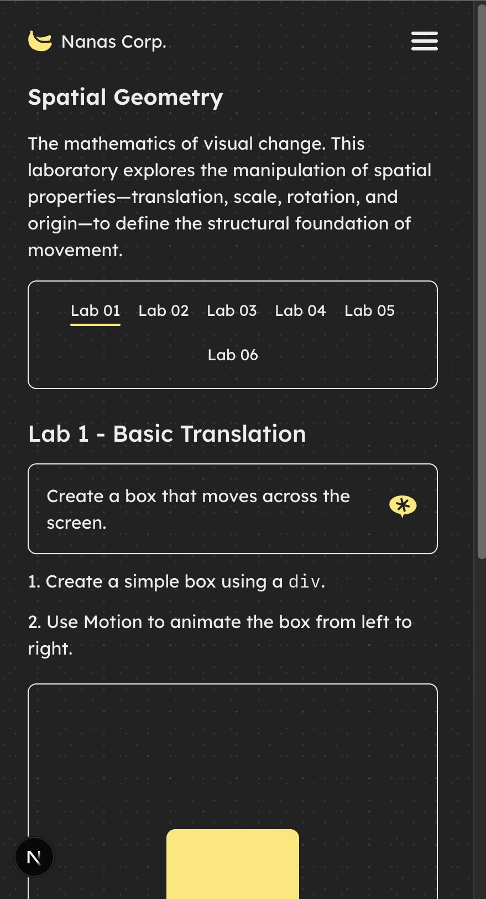
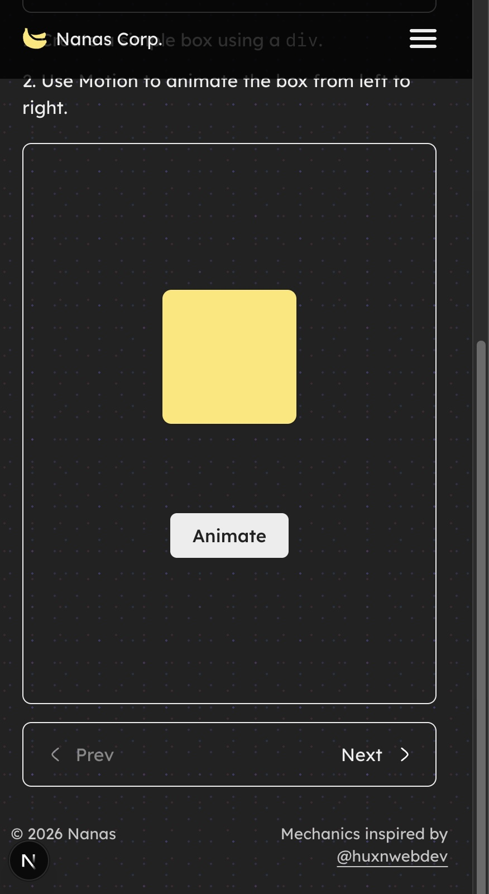
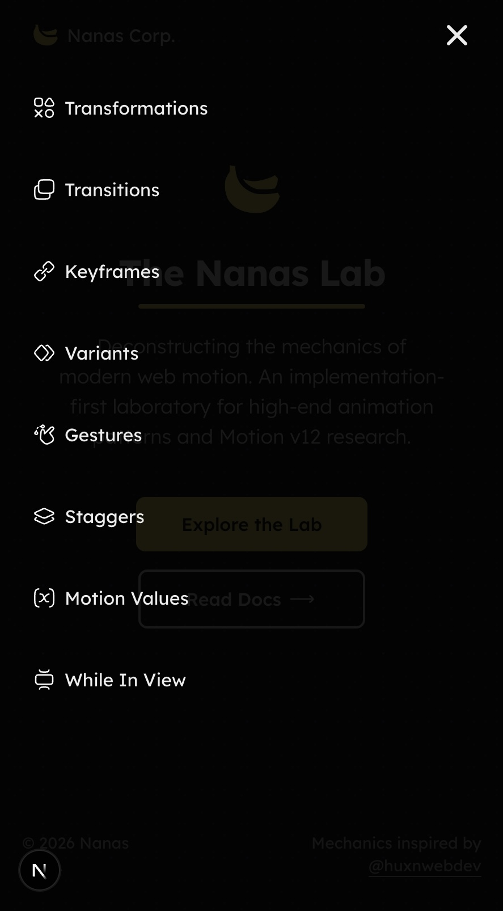

# The Nanas Lab

An experimental animation playground by **Nanas Corp**. This project is a curated collection of motion patterns and implementation showcases built with **Motion v12** and **Next.js 16**.

Instead of just theory, **The Nanas Lab** focuses on the *how*. Each experiment is a journey from a set of instructions to a living, breathing animation pattern, serving as a reference library for modern web motion.

## Preview

### Desktop
<div align="center">
  
  
</div>

### Mobile
<div align="center">
  
  
  
  
</div>

## Research Areas

The lab is organized into several key animation categories, each containing multiple practical implementations:

- **Gestures**: Interactive animations triggered by hover, tap, pan, and drag.
- **Keyframes**: Multi-stage animations with complex sequences.
- **Motion Value**: Tracking and reacting to dynamic values like scroll progress or cursor position.
- **Variants**: Organized animation states for cleaner, reusable code and staggered children.
- **Staggers**: Orchestrating animations for lists and groups of elements.
- **Transformations**: Position, scale, rotation, and skew animations.
- **Transitions**: Fine-tuning easing, duration, and spring physics.
- **While In View**: Animations triggered by scroll and viewport entry.

## Key Features

- **Implementation-First**: Focus on real-world animation patterns ready for production.
- **Interactive Labs**: Each experiment includes a set of objectives and instructions to guide the implementation.
- **Modern Tech**: Built with the latest versions of Next.js, Motion, and Tailwind CSS.
- **Responsive Design**: All animations and UI are optimized for both desktop and mobile experiences.
- **Shared Design System**: Consistent typography (Lexend Deca) and a custom color palette across all labs.

## Tech Stack

- **Framework**: [Next.js 16](https://nextjs.org/) (App Router)
- **Library**: [Motion v12](https://motion.dev/)
- **Styling**: [Tailwind CSS v4](https://tailwindcss.com/)
- **Language**: [TypeScript](https://www.typescriptlang.org/)
- **Typography**: [Lexend Deca](https://fonts.google.com/specimen/Lexend+Deca)

## Project Structure

- `app/(routes)/` - The core laboratory containing categorized animation experiments (Gestures, Keyframes, etc.).
- `app/ui/` - Page-specific UI components and layout logic.
- `components/` - Reusable UI components:
  - `Lab.tsx` - The standardized wrapper for all animation experiments.
  - `navbar/` & `pagination/` - Navigation systems for browsing between labs.
  - Custom UI elements like `BackgroundGrid`, `Underline`, and `PopUpContainer`.
- `config/` - Centralized configuration for laboratory navigation and metadata.
- `public/assets/` - Optimized SVGs, icons, and graphic assets.
- `libs/` & `utils/` - Shared utility functions and library initializations.
- `provider/` - Global state providers (e.g., Mobile Menu, Theme).

## Lab Setup

### Prerequisites
- Node.js (Latest LTS)
- `pnpm` (recommended)

### Installation
```bash
pnpm install
```

### Development
```bash
pnpm dev
```
The lab will be available at `http://localhost:3000`.

## Credits & Resources

- **Icons**: [Hugeicons](https://hugeicons.com/) (`@hugeicons/react`)
- **Photography**: [Unsplash](https://unsplash.com/)
- **Illustrations**: [unDraw](https://undraw.co/)
- **Inspiration**: Implementations inspired by modern motion design patterns and the Motion.dev community.

## License

MIT — Created with passion by **Nanas Corp**.
